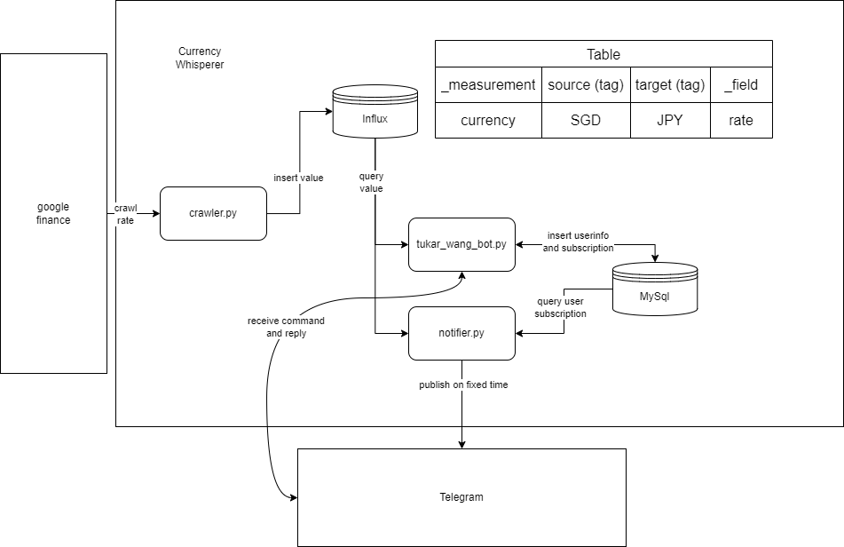

To be added soon HAHA

# Currency Whisperer
Link to Telegram bot: https://t.me/TukarWangBot
## Introduction
Currency Whisperer is a Python-powered Telegram bot designed to help users stay updated on currency exchange rates. With this bot, users can easily subscribe to the currencies they're interested in and receive daily updates on the exchange rates, sourced directly from Google Finance. The bot also includes a handy currency conversion calculator, allowing users to input an amount in one currency and instantly see the equivalent value in another. Whether you need to monitor rates for travel, investments, or just stay informed, Currency Whisperer makes it simple and convenient!

## How this bot works

## Future Implementations
If you have idea or suggestion on how to improve the bot, please feel free to create issues.

There are some ideas I collected, maybe these features will appear in the future, depends on my schedule:
1. Locate user's current location and show the nearest money changer
2. User can specify a target rate, and a notification will be sent when the exchange rate reach the target rate
3. A algorithm to predict the currency exchange rate